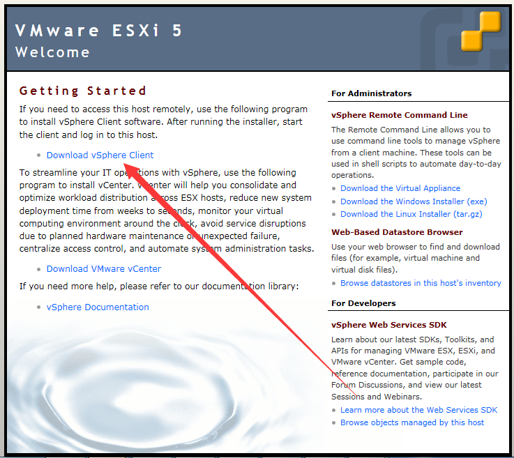

管理环境安装
=================

0x00 查看管理IP地址
-------------------

远程管理VMware ESXi需要知道ESXi使用的IP。在实验室环境下，这个IP应该是在网络中心有备案固定分配的，不会发生变化。为了以防万一，此处还是说明一下查看IP的方法。在操作系统启动完成之后，界面上应该直接有显示管理IP。如果没有，可以照左下角提示，按键进入管理界面，在网络配置的的菜单里可以查看IP。

0x01 下载管理环境
----------------------------------

在浏览器中直接输入管理IP地址（不要问我为啥用IE），浏览器会出现证书错误。

不要怂，点“继续浏览网站”，然后就会出现这个

点击“Download vSphere Client”，这个需要连接外网，（请先充好值，准备好迅雷效果奇佳）

下载完以后安装，因为找不到安装程序了，这边就不上图

0x02 管理环境简介
---------------------

这个ESXi的远程管理工具是官方的vSphere Client，打开的话是长这样的登录界面

敲入管理IP地址，用户名密码（这俩请到实验室内部的文档里找哟），连啊（不要手贱去点那个使用windows凭据啥的）

经过漫长的等待，终于登录接界面褪去，主界面出现，但其实这个主界面也没啥功能

主要就俩，一个是右键，带着诸多功能的菜单（其实就用一“创建虚拟机”）

另一个是配置选项卡，一堆可以配置的（其实也就用“存储器”和“网络”）

就扯这么多吧，具体像新建，存储器管理这些功能，请到专门的文章中仔细阅读